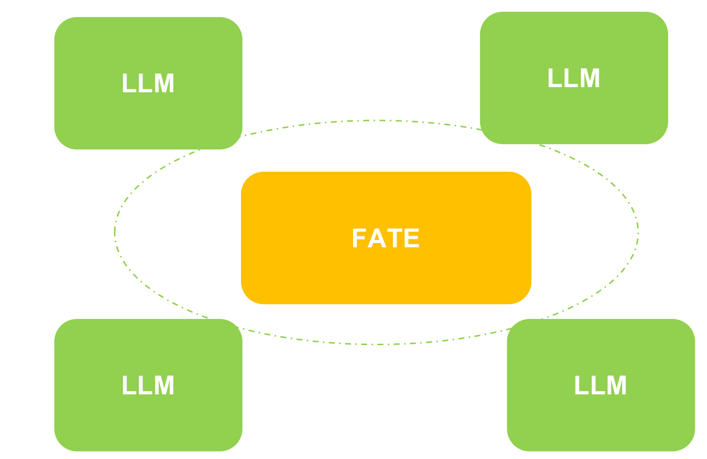
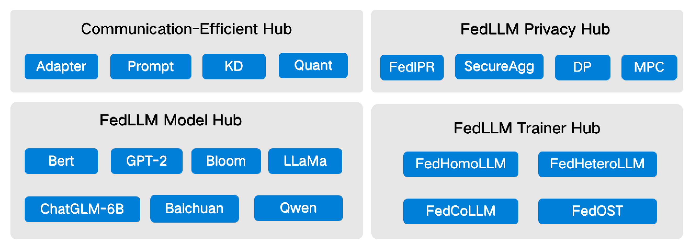

# FATE-LLM
FATE-LLM is a framework to support federated learning for large language models(LLMs) and small language models(SLMs).
<div align="center">
  
</div>

## Design Principle
- Federated learning for large language models(LLMs) and small language models(SLMs).
- Promote training efficiency of federated LLMs using Parameter-Efficient methods.
- Protect the IP of LLMs using FedIPR.
- Protect data privacy during training and inference through privacy preserving mechanisms.
<div align="center">
  
</div>

### Standalone deployment
* To deploy FATE-LLM v2.2.0 or higher version, three ways are provided, please refer [deploy tutorial](./doc/standalone_deploy.md) for more details:
  * deploy with FATE only from pypi then using Launcher to run tasks
  * deploy with FATE、FATE-Flow、FATE-Client from pypi, user can run tasks with Pipeline  
* To deploy lower versions: please refer to [FATE-Standalone deployment](https://github.com/FederatedAI/FATE#standalone-deployment).   
  * To deploy FATE-LLM v2.0.* - FATE-LLM v2.1.*, deploy FATE-Standalone with version >= 2.1, then make a new directory `{fate_install}/fate_llm` and clone the code into it, install the python requirements, and add `{fate_install}/fate_llm/python` to `PYTHONPATH` 
  * To deploy FATE-LLM v1.x, deploy FATE-Standalone with 1.11.3 <= version < 2.0, then copy directory `python/fate_llm` to `{fate_install}/fate/python/fate_llm` 

### Cluster deployment
Use [FATE-LLM deployment packages](https://github.com/FederatedAI/FATE/wiki/Download#llm%E9%83%A8%E7%BD%B2%E5%8C%85) to deploy,  refer to [FATE-Cluster deployment](https://github.com/FederatedAI/FATE#cluster-deployment) for more deployment details.

## Quick Start

- [Federated ChatGLM3-6B Training](doc/tutorial/pellm/ChatGLM3-6B_ds.ipynb)
- [Builtin Models In PELLM](doc/tutorial/pellm/builtin_pellm_models.md)
- [Offsite Tuning: Transfer Learning without Full Model](./doc/tutorial/offsite_tuning/Offsite_tuning_tutorial.ipynb)
- [FedKSeed: Federated Full-Parameter Tuning of Billion-Sized Language Models
with Communication Cost under 18 Kilobytes](./doc/tutorial/fedkseed/)
- [InferDPT: Privacy-preserving Inference for Black-box Large Language Models](./doc/tutorial/inferdpt/inferdpt_tutorial.ipynb)
- [FedMKT: Federated Mutual Knowledge Transfer for Large and Small
Language Models](./doc/tutorial/fedmkt/)
- [PDSS: A Privacy-Preserving Framework for Step-by-Step Distillation of Large Language Models](./doc/tutorial/pdss)
- [FDKT: Federated Domain-Specific Knowledge Transfer on Large Language Models Using Synthetic Data](./doc/tutorial/fdkt)

## FATE-LLM Evaluate

- [Python SDK & CLI Usage Guide](./doc/fate_llm_evaluate.md)

## Citation

If you publish work that uses FATE-LLM, please cite FATE-LLM as follows:
```
@article{fan2023fate,
  title={Fate-llm: A industrial grade federated learning framework for large language models},
  author={Fan, Tao and Kang, Yan and Ma, Guoqiang and Chen, Weijing and Wei, Wenbin and Fan, Lixin and Yang, Qiang},
  journal={Symposium on Advances and Open Problems in Large Language Models (LLM@IJCAI'23)},
  year={2023}
}
```
