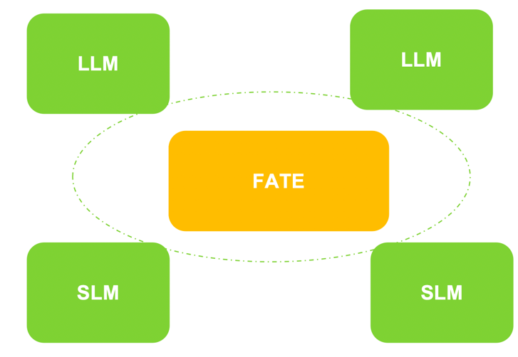

# FATE-LLM
FATE-LLM is a framework to support federated learning for large language models(LLMs).
<div align="center">
  
</div>

## Design Principle
- Federated learning for heterogeneous large model and small model.
- Promote training efficiency of federated LLMs using Parameter-Efficient methods.
- Protect the IP of LLMs using FedIPR.
- Protect data privacy during training and inference through privacy preserving mechanisms.
<div align="center">
  
</div>

## Deployment

### Standalone deployment
Please refer to [FATE-Standalone deployment](https://github.com/FederatedAI/FATE#standalone-deployment).  
Deploy FATE-Standalone version with 1.11.3 <= version < 2.0, then copy directory `python/fate_llm` to `{fate_install}/fate/python/fate_llm`

### Cluster deployment
Use [FATE-LLM deployment packages](https://github.com/FederatedAI/FATE/wiki/Download#llm%E9%83%A8%E7%BD%B2%E5%8C%85) to deploy,  refer to [FATE-Cluster deployment](https://github.com/FederatedAI/FATE#cluster-deployment) for more deployment details.

## Quick Start
- [Offsite-tuning Tutorial: Model Definition and Job Submission](./doc/tutorial/offsite_tuning/Offsite_tuning_tutorial.ipynb)
- [FedIPR Tutorial: Add Watermarks to Your Model](./doc/tutorial/fed_ipr/FedIPR-tutorial.ipynb)
- [Federated ChatGLM-6B Training](./doc/tutorial/parameter_efficient_llm/ChatGLM-6B_ds.ipynb)
- [GPT-2 Training](./doc/tutorial/parameter_efficient_llm/GPT2-example.ipynb)
- [Builtin Models In PELLM](./doc/tutorial/builtin_models.md)

## Citation

If you publish work that uses FATE-LLM, please cite FATE-LLM as follows:
```
@article{fan2023fate,
  title={Fate-llm: A industrial grade federated learning framework for large language models},
  author={Fan, Tao and Kang, Yan and Ma, Guoqiang and Chen, Weijing and Wei, Wenbin and Fan, Lixin and Yang, Qiang},
  journal={arXiv preprint arXiv:2310.10049},
  year={2023}
}
```