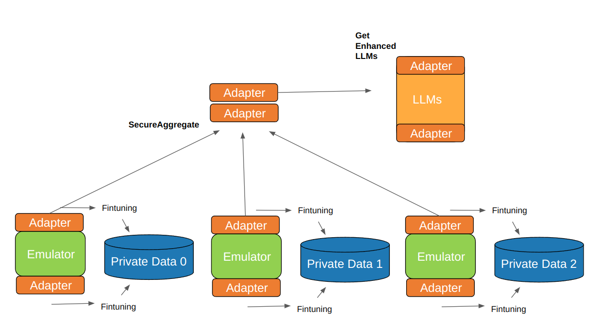

# Offsite-Tuning

## Standard Offsite-tuning

Offsite-Tuning is designed for the efficient adaptation of large foundational models for specific downstream tasks. 
Through Offsite-Tuning, the model owner can enhance the capabilities of large models using data providers without having to disclose the full model weights and directly access the data providers' sensitive information. Specifically, the LLM owner sends a lightweight "Adapter" and a lossy compressed "Emulator" to the data owner. Using these smaller components, the data owner can then fine-tune the model solely on their private data. The Adapter, once fine-tuned, is returned to the model owner and integrated back into the large model to enhance its performance on the specific dataset.

In FATE-LLM 1.3, we provide these built-in models:

- GPT2 series models (e.g., GPT2, GPT2-XL, etc.)
- Bloom series models (such as Bloom7B)
- Llama-1 series models (e.g., Llama7B)

FATE-LLM v1.3 builds on v1.2 and offers the ability to easily configure multi-machine and multi-card acceleration. It also has specialized optimizations for the network transmission of adapters and emulators.

[Read the full paper](https://arxiv.org/abs/2302.04870)

  

## Offsite-tuning with Federated Learning

In addition to supporting standard two-party (model owner and data provider) offsite-tuning, FATE also supports offsite-tuning with multiple data providers simultaneously. Adapters can be fine-tuned locally and then aggregated with those from other data providers. Ultimately, large models can be enhanced through the aggregation of adapters from multiple parties. This approach can be used to address issues related to the uneven distribution of computational power and data.
As shown in the diagram below:

  

